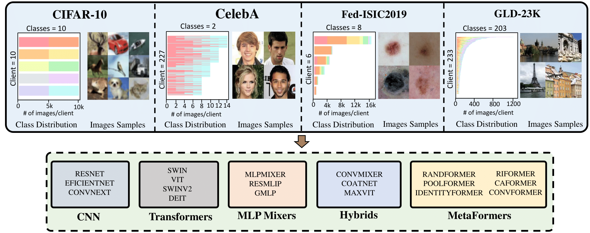

# Handling Data Heterogeneity via Architectural Design for Federated Visual Recognition [NeurIPS-23]

[](https://arxiv.org/abs/2310.15165)


# 🚀 News

- **Oct 23, 2023**: Archive and Data release.

- **Oct 23, 2023**: Code now available! 🔥 Data release coming soon.

- **Sept 21, 2023**: Thrilled to announce our paper has been accepted at NeurIPS! 🔥🔥🔥

## Index
1. [Highlights](#highlights)
2. [Environment](#environment)
3. [QuickStart](#quickstart)
4. [Data](#data)
5. [Results](#results)
6. [Acknowledgements](#acknowledgements)
7. [Citation](#citation)

---

<a name="highlights"></a>
## 1. Highlights
<div style="text-align: center">

</div>
</center>

### Abstract: 
> Federated Learning (FL) is a promising research paradigm that enables the collabo-
rative training of machine learning models among various parties without the need
for sensitive information exchange. Nonetheless, retaining data in individual clients
introduces fundamental challenges to achieving performance on par with centrally
trained models. Our study provides an extensive review of federated learning
applied to visual recognition. It underscores the critical role of thoughtful archi-
tectural design choices in achieving optimal performance, a factor often neglected
in the FL literature. Many existing FL solutions are tested on shallow or simple
networks, which may not accurately reflect real-world applications. This practice
restricts the transferability of research findings to large-scale visual recognition
models. Through an in-depth analysis of diverse cutting-edge architectures such
as convolutional neural networks, transformers, and MLP-mixers, we experimen-
tally demonstrate that architectural choices can substantially enhance FL systems’
performance, particularly when handling heterogeneous data. We study 19 visual
recognition models from five different architectural families on four challenging
FL datasets. We also re-investigate the inferior performance of convolution-based
architectures in the FL setting and analyze the influence of normalization layers
on the FL performance. Our findings emphasize the importance of architectural
design for computer vision tasks in practical scenarios, effectively narrowing the
performance gap between federated and centralized learning


### Experimental Insights:

- **Diverse Model Testing**: We rigorously tested 19 visual recognition models from five unique architectural families, including CNNs, Transformers, MLP-Mixers, Hybrids, and Metaformers,  across four challenging FL datasets.

- **Re-Evaluating Convolution-Based Architectures**: Our tests in high heterogeneity settings divulged that convolution operations are not essentially flawed for FL applications. Notably, Metaformer-like architectures displayed superior robustness in non-IID data settings.

- **Best Performing Models**: Our exploration revealed that ViT and Metafomer models (CAFormer, ConvFormer) achieve the best performance and low drop compared to centralized settings.
  
- **Normalization Discoveries**: Batch Normalization (BN) can hamper performance in a heterogeneous FL context. Our empirical studies show that replacing BN with Layer Normalization effectively mitigates this performance drop, underscoring the significant impact of architectural decisions on FL performance.

- **Optimizers vs. Architectural Design**: An analysis of complex networks with four distinct optimizers yielded a compelling revelation. While optimization methods didn't drastically improve performance for these architectures, architectural alterations emerged as a more effective and straightforward approach in practical applications.

---

<a name="environment"></a>
## 2. Environment


Create your Conda environment with python 3.8:
```bash
conda create --name fed_het python=3.8
```
Activate your environment:
```bash
conda activate fed_het
```

**Dependencies:**

You can install the dependencies using the following command:
```bash
pip install -r requirements.txt
```

---

<a name="quickstart"></a>
## 3. QuickStart

To train ViT-small with FedAVG on CIFAR-10 Split-3 using the default parameters, you can run the following command:


```bash
python train_FedAVG.py --FL_platform ViT-FedAVG --dataset cifar10 \
                       --local_epochs 1 --max_communication_rounds 100 --num_local_clients -1 \
                       --split_type split_3
```

For detailed configurations and options, refer to the `train_FedAVG.py` file.

If you wish to run the Metaformer models, you need to clone the [MetaFormer repository](https://github.com/sail-sg/metaformer) inside the project folder and run the following command

```bash
pip install timm==0.6.11
```

---

<a name="data"></a>
## 4. Data & Weights

The dataset splits and weights for the pretrained versions of PoolFormer-S12 (with BN and with LN) and on ImageNet are accessible at this [link](https://drive.google.com/drive/folders/15C50aNXKCtols8ifZUzIDdVp-NFqMRiG?usp=drive_link). 

Download the archives unzip if necessary, and place them at sub-folder data as follows: 

**Structure:**

```
data/
|--- cifar10/
|    |--- cifar10.npy
|
|--- celeba/
|    |--- celeba.npy
|    |--- celeba_images/
|
|--- gldk23/
|    |--- ...
|
|--- isic19/
|    |--- ...

```

For more details on the data and how it's structured, refer to the `data/README.md` within the data directory.

---

<a name="results"></a>
## 5. Results

**Performance of different types of models across all splits of CIFAR-10.** The average test accuracy of the model is displayed along with the standard deviation of the experiments. Split-3 shows the degradation compared to the centralized version of the training.

| Model                                      | Central           | Split-1         | Split-2          | Split-3                            |
|--------------------------------------------|-------------------|-----------------|------------------|-----------------------------------|
| ResNet-50                        | 95.9 ± 0.21       | 96.8 ± 0.17     | 92.7 ± 0.25      | 59.9 ± 1.87 (↓ 36.0)               |
| EfficientNet-B5                  | 97.6 ± 0.21       | 97.8 ± 0.06     | 95.1 ± 0.06      | 80.5 ± 0.92 (↓ 17.1)               |  
| ConvNeXt-T                       | 97.2 ± 0.15       | 97.6 ± 0.06     | 96.6 ± 0.21      | 93.5 ± 0.36 (↓ 3.7)                |
| Swin-T                           | 97.6 ± 0.15       | 97.9 ± 0.10     | 97.6 ± 0.06      | 95.7 ± 0.15 (↓ 1.9)                |     
| ViT-S                            | 97.6 ± 0.06       | 98.5 ± 0.10     | 98.2 ± 0.12      | 96.8 ± 0.15 (↓ 0.8)                |
| SwinV2-T                         | 96.4 ± 0.00       | 97.4 ± 0.10     | 96.4 ± 0.15      | 93.7 ± 0.38 (↓ 2.7)                |
| DeiT-S                           | 96.8 ± 0.12       | 97.8 ± 0.06     | 97.2 ± 0.12      | 95.2 ± 0.15 (↓ 1.6)                |
| ConvFormer-S18                   | 97.9 ± 0.12       | 98.4 ± 0.12     | 98.0 ± 0.12      | 96.8 ± 0.35 (↓ 1.2)                |
| CAFormer-S18                     | 98.1 ± 0.18       | 98.5 ± 0.06     | **98.3 ± 0.06**  | **97.1 ± 0.14** (↓ 1.0)            |
| RandFormer-S36                   | 95.7 ± 0.12       | 95.8 ± 0.10     | 94.6 ± 0.06      | 91.3 ± 0.35 (↓ 4.4)                |
| IdentityFormer-S36               | 95.3 ± 0.26       | 95.6 ± 0.12     | 94.6 ± 0.12      | 90.8 ± 0.45 (↓ 4.5)                |
| PoolFormer-S36                   | 97.1 ± 0.25       | 97.4 ± 0.10     | 96.9 ± 0.06      | 95.2 ± 0.12 (↓ 1.9)                |
| RIFormer-S36                     | 95.9 ± 0.08       | 96.6 ± 0.16     | 95.5 ± 0.15      | 93.0 ± 0.10 (↓ 2.9)                |
| MLPMixer-S/16                    | 94.8 ± 0.10       | 96.5 ± 0.12     | 95.6 ± 0.06      | 92.7 ± 0.06 (↓ 2.1)                |
| ResMLP-S24                       | 96.2 ± 0.10       | 97.2 ± 0.10     | 96.7 ± 0.06      | 94.1 ± 0.17 (↓ 2.1)                |
| gMLP-S                           | 96.9 ± 0.26       | 98.0 ± 0.06     | 97.6 ± 0.12      | 96.1 ± 0.23 (↓ 0.8)                |
| ConvMixer-768/32                 | 97.4 ± 0.12       | 97.3 ± 0.06     | 94.4 ± 0.15      | 74.1 ± 1.07 (↓ 23.3)               |
| COATNET-0                        | 97.7 ± 0.15       | 98.3 ± 0.15     | 97.5 ± 0.06      | 94.2 ± 0.06 (↓ 3.4)                |
| MAXVIT-T                         | 98.0 ± 0.10       | **98.6 ± 0.10** | 97.3 ± 0.12      | 92.0 ± 1.15 (↓ 6.0)               |


<a name="acknowledgements"></a>
## 6. Acknowledgements

This work has been partially supported by the **MBZUAI-WIS Joint Program for AI Research**.  
**Project Grant Number:** WIS P008.

Our code is based on [ViT-FL-main repository](https://github.com/Liangqiong/ViT-FL-main). We thank the authors for releasing their code.  
We extend our gratitude to the authors of [MetaFormer Baselines for Vision](https://github.com/sail-sg/metaformer) and [timm](https://github.com/huggingface/pytorch-image-models)  for their model releases.

---


<a name="citation"></a>
## 7. Citation

If you find this work helpful and use it in your projects or publications, please cite our paper:

```
@article{pieri2023handling,
  title={Handling Data Heterogeneity via Architectural Design for Federated Visual Recognition},
  author={Pieri, Sara and Restom, Jose Renato and Horvath, Samuel and Cholakkal, Hisham},
  journal={arXiv preprint arXiv:2310.15165},
  year={2023}
}
```
